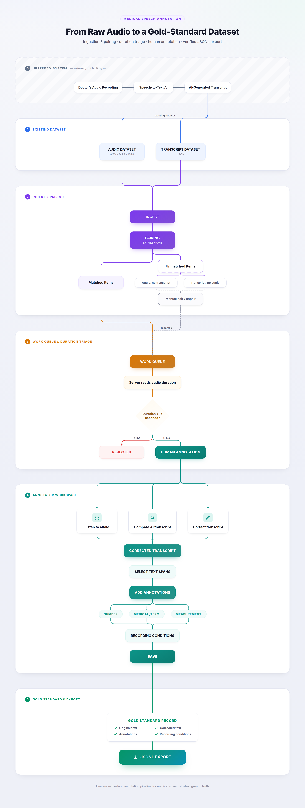
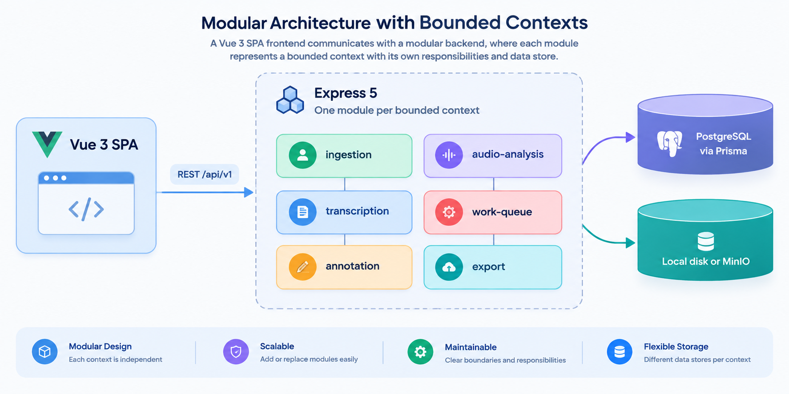
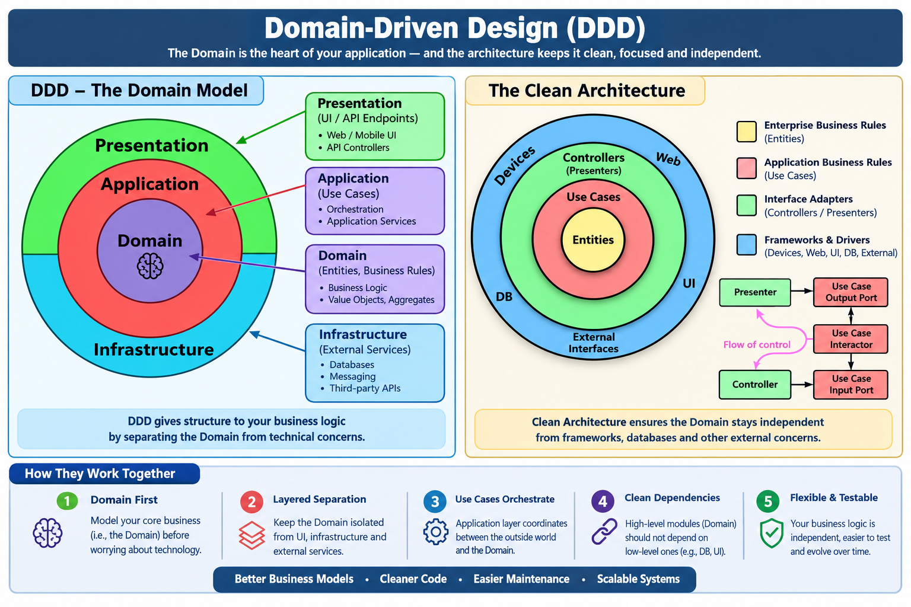

# ClinAnnotate

A gold standard annotation workbench for German clinical dictation.

The name carries two readings: spoken aloud it sounds like *clean annotate*; written down it puts the clinical context front and centre.

Doctors dictate operation reports, and a speech model produces a first pass transcript. ClinAnnotate is the tool a human annotator uses, all day, to correct that transcript and enrich it with structured spans, so the result can be used both to measure the model and to fine tune it.

[](https://nodejs.org)
[](https://www.typescriptlang.org/)
[](https://expressjs.com)
[](https://vuejs.org)
[](https://www.prisma.io)
[](https://www.postgresql.org)

---

## Overview

ClinAnnotate is **not** a speech-to-text system. It sits at the annotation stage — after the AI model has already produced a first-pass transcript. The annotator's job is to correct that transcript and enrich it with typed spans. The five stages below are the entire application:



| Stage | What happens |
|---|---|
| **Ingest & pairing** | Audio files and an AI transcript JSON array are imported as two independent datasets, then reconciled by filename. Unmatched items in either direction are surfaced — nothing is dropped silently. |
| **Work queue & routing** | Duration is read server-side from each file. Recordings of 15 seconds or less are automatically rejected and stored with a terminal status. The rest enter a filterable, sortable queue. |
| **Annotator workspace** | The annotator listens, edits the corrected transcript copy, and selects spans to tag. The original AI transcript is immutable — it is the baseline for word error rate computation. |
| **Recording conditions** | Duration, sample rate, speech rate and microphone-distance estimate are captured per item and are overridable before export. |
| **Gold-standard export** | One JSONL line per completed item: both transcripts, WER, every span with typed attributes, and the recording conditions. |

---

## Contents

[Overview](#overview) | [Quick start](#quick-start) | [Demo path](#demo-path) | [Requirements coverage](#requirements-coverage) | [Architecture](#architecture) | [Stack](#stack) | [Using the tool](#using-the-tool) | [Keyboard shortcuts](#keyboard-shortcuts) | [Tests](#tests) | [Project structure](#project-structure) | [API](#api) | [Export format](#export-format) | [Decisions](#decisions-and-ambiguity-resolutions) | [Limitations](#known-limitations)

---

## Quick start

Prerequisites:

- Node.js 22.x. Check with `node -v`, or run `nvm use` if you have nvm, since `.nvmrc` is committed.
- Docker with Compose v2. Check with `docker compose version`.
- Yarn 4. Running `corepack enable` provides it on Node 22.
- Around 500 MB of free disk for the Postgres volume and the demo fixtures.

You do not need to install ffmpeg. `ffmpeg-static` and `ffprobe-static` ship as dependencies. There are no API keys, no external services, and no network access is needed after `yarn install`.

To run it:

```bash
git clone <repo-url> && cd clinical-audio-annotation-tool
cp .env.example .env

docker compose up -d --wait   # Postgres 16, waits until it accepts connections
yarn bootstrap                # install, migrate, seed, then start the API and the web app
```

Open http://localhost:5173. The queue is already populated.

`yarn bootstrap` is a convenience wrapper. The explicit equivalent is:

```bash
yarn install
yarn workspace api prisma migrate deploy
yarn workspace api db:seed
yarn dev                      # API on :4000, web on :5173
```

The `--wait` flag matters. Without it, `docker compose up -d` returns as soon as the container starts rather than when Postgres accepts connections, and the migration step then fails intermittently.

## Demo path

The seed script at `apps/api/prisma/seed.ts` loads six fixtures from `fixtures/`, chosen so that every interesting rule is visible within a minute of opening the app.

| Fixture | What it shows |
|---|---|
| `demo-01.wav`, around 40 seconds, WAV with `bext` and `LIST INFO` | The happy path, and a fully populated recording conditions panel |
| `demo-02.wav`, 12 seconds | The 15 second rejection rule firing, visible in the queue as `REJECTED_TOO_SHORT` |
| `demo-03.mp3` | Format coverage, and bit depth correctly shown as not applicable for compressed formats |
| `demo-04.m4a`, with no transcript row | Unmatched audio, surfaced in the pairing review |
| transcript row `audio/demo-99.wav`, with no file | Unmatched transcript row, surfaced in the pairing review |
| `demo-05.wav` | The brief's worked example, pre-annotated with all six span types |

Open `demo-05` first. You will see `Cefuroxim` tagged as a drug under `MEDICAL_TERM`, 1500 mg normalised to 1.5 g, "neue Zeile" tagged as a `FORMATTING_COMMAND` with the literal against command flag set, and "sechs null" resolved to 6/0.

Transcripts use the format from the brief:

```json
[
  { "path": "audio/demo-01.wav", "label": "Kontrollierte Rueckenlagerung des Patienten..." },
  { "path": "audio/demo-05.wav", "label": "Single-Shot-Antibiose mit Cefuroxim..." }
]
```

## Requirements coverage

The honest state of every requirement in the brief.

| Requirement | State | Note |
|---|---|---|
| **Ingest** | | |
| Multi file upload of `.wav`, `.mp3` and `.m4a`, with type and size validation | Done | Magic byte check, not just the extension |
| Transcript JSON import with per row error reporting | Done | Malformed JSON, missing fields and duplicate paths each reported. Good rows still import |
| Paste a single transcript | Done | |
| Filename pairing, unmatched items shown in both directions, manual pair and unpair | Done | Ladder and ambiguity handling described below |
| **Work queue** | | |
| Filename, duration, status, annotator | Done | Annotator is a plain string, since auth is out of scope under section 5 |
| Server side duration, with the client never trusted | Done | Read by ffprobe at ingest |
| Filter and sort by status and duration | Done | |
| 15 second routing rule | Done | 15.0s or less becomes `REJECTED_TOO_SHORT`, stored rather than deleted |
| **Audio player** | | |
| Play and pause, seek, speed, jump backward and forward | Done | |
| Keyboard shortcuts, documented in the app | Done | Behind `?`, and in the table below |
| Click a word to seek | Done | Timings are estimated — method in [`DESIGN.md`](./DESIGN.md), section 4 |
| **Transcript** | | |
| Immutable original | Done | `BEFORE UPDATE` trigger on `Transcript`; no code path can overwrite `originalText` |
| Editable corrected copy and diff view | Done | Dual pane, token-level LCS diff, 750 ms debounced autosave |
| **Annotation** | | |
| `MEDICAL_TERM`, `MEASUREMENT`, `NUMBER`, `FORMATTING_COMMAND`, `NAMED_ENTITY` | Done | |
| `SPELLED_OUT` | Partial | Ships without spelling alphabet detection. The annotator types the resolved word |
| Span create, edit and delete, with attributes preserved | Done | |
| Overlapping spans | Partial | Allowed and stored. Version 1 renders the outermost inline and lists shadowed spans in the panel |
| **Recording conditions** | | |
| Duration, sample rate, channels, bit depth | Done | Bit depth is not applicable for MP3 and M4A, since it is undefined for lossy formats |
| `bext` and `LIST INFO` metadata | Done | RIFF chunks, so WAV only. The panel says so when they are absent |
| Speech rate in words per minute, overridable | Done | Whitespace tokenisation, a documented simplification |
| Distance estimate, overridable | Done | RMS to noise floor heuristic, labelled as an estimate everywhere |
| Override precedence is correct | Done | Tested: `final` equals the override when set, the derived value otherwise |
| **Export** | | |
| JSONL with the audio reference, both transcripts, spans, attributes and conditions | Done | Streaming NDJSON, one line per DONE recording — see [Export format](#export-format) |
| **Beyond the brief** | | |
| Word error rate, original against corrected | Done | Computed and cached per item; surfaced in the queue and included in the export |
| Architecture test: the domain layer imports no framework | Done | A dependency cruiser rule, run by `yarn test` |
| **Out of scope** | | |
| Undo and redo across span operations | Out of scope | Native text undo only. See [`DESIGN.md`](./DESIGN.md), section 5 |
| MinIO wiring | Out of scope | Port and adapter exist. Local disk is wired, following the one machine assumption |

## Architecture



The API follows Domain-Driven Design. Each bounded context above is internally structured in four layers — domain, application, infrastructure, presentation — with dependencies that only ever point inward:



The domain layer holds the parts that are actually this product: the 15 second routing rule, the pairing ladder, unit normalisation, span re-anchoring and word error rate. It imports nothing — no Express, no Prisma, no Zod, no Node built-ins — and those pieces are unit tested without a database, a server or a browser.

That claim is checked rather than merely asserted. A dependency-cruiser rule fails the test suite if any file under a domain folder imports a framework.

Express has no dependency injection container, so the composition root is written by hand: 48 lines in `src/main/container.ts` that construct every adapter and pass them into each context's module factory. Every dependency edge in the system is visible in that one file. The full reasoning is in [`IMPLEMENTATION_PLAN.md`](./IMPLEMENTATION_PLAN.md#4-architecture).

## Stack

| Layer | Choice |
|---|---|
| Runtime | Node.js 22, TypeScript 6 in strict mode |
| HTTP | Express 5 |
| ORM and migrations | Prisma, confined to `infrastructure/adapters`. The domain never imports it |
| Database | PostgreSQL 16, via Docker Compose |
| Object storage | Local disk by default, with a MinIO adapter behind the same port |
| Frontend | Vue 3, `<script setup>`, Composition API |
| Frontend state | Per feature composables, no store library |
| Styling | Tailwind CSS v4 via `@tailwindcss/vite`; design tokens in a `@theme` block in `main.css`, no `tailwind.config.js` |
| Audio | `ffprobe-static` for headers, `ffmpeg-static` for PCM decode, and a hand written RIFF reader for `bext` and `LIST INFO` |
| Validation | Zod, shared between API and web through `packages/contracts` |
| Testing | Vitest, Supertest, dockerised Postgres, dependency cruiser |
| Package manager | Yarn 4 workspaces: `apps/api`, `apps/web`, `packages/contracts` |

There are no deviations from the mandated stack. Two were considered and rejected, NestJS on the Express adapter and Drizzle instead of Prisma, with reasons in [`DESIGN.md`](./DESIGN.md), section 3, along with the three additive choices made beyond the brief.

## Using the tool

1. Upload. Drag audio files or a transcript JSON onto the ingest screen, or paste a single transcript directly.
2. Resolve pairing. Anything that did not match automatically by filename appears in a review list. Pair it or leave it, but nothing is dropped silently.
3. Work the queue. Filter by status and sort by duration or by word error rate. A high error rate means the model struggled, and those are often the most valuable items to correct first.
4. Annotate. Select text, press `1` to `6` to tag it, fill in the typed attributes and keep going. The popover follows the selection rather than stealing focus.
5. Check conditions. Confirm or override the suggested speech rate and distance. Both are pre-filled estimates and are never presented as measured values.
6. Export. Pull the JSONL gold standard for everything marked `DONE`.

## Keyboard shortcuts

Also available in the app behind `?`.

**Audio player:**

| Key | Action |
|---|---|
| `Space` | Play or pause |
| `← / J` | Skip back 5 seconds |
| `→ / L` | Skip forward 5 seconds |
| `, / [` | Decrease playback speed by 0.25× |
| `. / ]` | Increase playback speed by 0.25× |
| `?` | Toggle this overlay |

**Annotation workspace:**

| Key | Action |
|---|---|
| `1` to `6` | Tag the selection: medical term, measurement, number, formatting command, named entity, spelled out |
| `T` | Open span type picker |
| `Esc` | Cancel, or close the popover |
| `Ctrl/Cmd+Z` | Undo a text edit (native browser undo inside the corrected pane) |
| `Ctrl/Cmd+S` | Save transcript now |
| `Ctrl/Cmd+Enter` | Complete and navigate to the next queued item |
| Click a word | Seek to that word's estimated timestamp |

## Tests

```bash
yarn test                 # both workspaces, spins up a throwaway Postgres
yarn workspace api test
yarn workspace web test
```

Effort is concentrated where a bug would actually hurt:

- Routing rule. 15.0 seconds or less is rejected, tested at 14.999, 15.000 and 15.001 against the raw ffprobe float with no rounding.
- Pairing ladder. Every rung, plus duplicate paths, unmatched audio, unmatched rows and the ambiguous basename case.
- Unit normalisation. Every unit in the brief, including the two that must not be converted.
- Span persistence. Create, update and delete round trips, and re-anchoring after the transcript is edited underneath a span.
- Original transcript immutability. A direct `UPDATE` is attempted and asserted to fail at the database trigger level. An integration test covers this as part of the transcript use-case suite.
- Override precedence. `final` equals the override when one is set, and the derived value when not. Easy to get backwards, and silent when wrong.
- Export assembler. Seven unit tests over the `GoldStandardAssembler`, covering provenance flags (`speechRateSource`), empty span lists, and the `distanceMethod` passthrough.
- Architecture. No domain file imports a framework.
- Word error rate. Substitution, deletion, insertion, identical strings and an empty reference.

**End-to-end (Playwright).** A Chromium suite in `apps/web/e2e/` covers the four primary user-facing flows. Requires both servers running (`yarn dev` in a separate terminal).

```bash
yarn workspace web e2e        # run all e2e specs headlessly
yarn workspace web e2e:ui     # interactive Playwright UI mode
```

| Spec | What it exercises |
|---|---|
| `work-queue.spec.ts` | Queue renders seeded recordings; status badge and duration visible |
| `audio-player.spec.ts` | Play/pause, skip controls, speed selector, keyboard shortcuts |
| `span-annotation.spec.ts` | Select text, open popover, submit a span, see it listed |
| `word-seek.spec.ts` | Click a word token, assert the player time advances |

## Project structure

```
apps/api/src/
  ingestion/           # upload, transcript import, filename pairing, bad row reporting
  transcription/       # immutable original against corrected, re-anchoring, word alignment, WER
  annotation/          # spans and the six typed attribute schemas, unit normalisation
  audio-analysis/      # header metadata, frame energy, speech rate, distance estimate
  work-queue/          # queue read model, filtering, the 15 second routing rule
  export/              # JSONL assembly across the contexts above
  shared/              # base Entity, AggregateRoot and value objects, exception filters, audio kernel, config
  main/                # container.ts (composition root), app.ts, server.ts

  # every context above contains:
  #   domain/{entities,value-objects,services,exceptions}
  #   application/{ports,use-cases/<name>/{*.command.ts,*.handler.ts}}
  #   infrastructure/adapters/
  #   presentation/{*.controller.ts,dtos/}
  #   <context>.module.ts

apps/web/src/features/   # one folder per context above, mirrored one to one
packages/contracts/      # Zod schemas shared by API and web, so they cannot drift
fixtures/                # demo audio and transcripts.json
docker-compose.yml
```

File naming is consistent with the DDD conventions used across this author's other projects: `*.entity.ts`, `*.vo.ts`, `*.port.ts`, `*.command.ts`, `*.handler.ts`, `*.dto.ts`, `*.repository.ts`, `*.adapter.ts`, `*.module.ts` and `*.exception.ts`.

## API

Everything sits under `/api/v1`.

| Context | Endpoint | Purpose |
|---|---|---|
| – | `GET /health` | Server liveness |
| ingestion | `POST /recordings` | Upload one or more audio files (multipart) |
| ingestion | `GET /recordings` | List recordings; optional `?status=` filter |
| ingestion | `GET /recordings/:id` | Single recording with full header metadata |
| ingestion | `POST /import-rows` | Bulk import the AI transcript JSON array |
| ingestion | `GET /import-rows` | Import row list; optional `?matched=` filter |
| ingestion | `PUT /import-rows/:id/pairing` | Manually pair an import row to a recording |
| ingestion | `DELETE /import-rows/:id/pairing` | Remove a pairing |
| annotation | `GET /recordings/:id/annotations` | List annotation spans |
| annotation | `POST /recordings/:id/annotations` | Create a span |
| annotation | `PATCH /annotations/:id` | Edit a span and its attributes |
| annotation | `DELETE /annotations/:id` | Remove a span |
| audio-analysis | `GET /recordings/:id/conditions` | Derived recording conditions |
| audio-analysis | `PATCH /recordings/:id/conditions` | Override speech rate or distance estimate |
| work-queue | `GET /queue` | Filtered, sorted, and paginated queue view |
| work-queue | `PATCH /queue/:id/status` | Transition a recording to a new status |
| transcription | `GET /recordings/:id/transcript` | Original, corrected, word timings and WER |
| transcription | `POST /recordings/:id/transcript` | Seed transcript for a recording (paste path) |
| transcription | `PATCH /recordings/:id/transcript/corrected` | Save edits; returns re-anchoring report |
| export | `GET /export` | Stream the JSONL gold standard for all DONE recordings |

Errors are uniform, shaped as `{ "error": { "code", "message", "details" } }`, with 422 for domain rule violations and 409 for illegal status transitions.

## Export format

One JSON object per line (`application/x-ndjson`). The filename is `clinannotate-<date>.jsonl`.

```json
{
  "audioFilename": "demo-05.wav",
  "storageKey": "abc123.wav",
  "durationSeconds": 42.3,
  "sampleRate": 16000,
  "channels": 1,
  "originalTranscript": "Single-Shot-Antibiose mit Cefuroxim...",
  "correctedTranscript": "Single-Shot-Antibiose mit Cefuroxim 1500 mg...",
  "wordErrorRate": 0.083,
  "alignmentMethod": "energy-gated",
  "wordTimings": [{ "w": "Single-Shot-Antibiose", "start": 0.0, "end": 0.9 }],
  "conditions": {
    "speechRateWpm": 132,
    "speechRateSource": "derived",
    "distanceBucket": "normal",
    "distanceMethod": "RMS-to-noise-floor ratio over 25 ms frames; heuristic, not a calibrated measurement"
  },
  "spans": [
    {
      "spanType": "MEASUREMENT",
      "startOffset": 31,
      "endOffset": 38,
      "anchorText": "1500 mg",
      "attributes": { "spanType": "MEASUREMENT", "value": 1500, "unit": "mg", "normalised": 1.5 },
      "needsReview": false
    }
  ],
  "exportedAt": "2026-09-09T12:00:00.000Z"
}
```

Every estimated value carries its provenance inline. `speechRateSource` is `"derived"` or `"override"`. `alignmentMethod` is `"energy-gated"` or `"proportional"`, both labelled as estimates in the UI. `distanceMethod` is the full description string.

## Decisions and ambiguity resolutions

The full reasoning is in [`DESIGN.md`](./DESIGN.md), section 4. The seven that mattered:

**Word timestamps have no source.** Section 4.3 requires click to seek, but the `{path, label}` input carries no timings and section 5 forbids a speech model. The resolution is an estimated alignment: decode once, take RMS over 25 ms frames, put the noise floor at the fifth percentile, then distribute tokens across the detected speech regions by character length. It is labelled as an estimate in the interface and in the export, exactly as the brief labels its own distance estimate. The importer also accepts real per word timings if a future speech model supplies them.

**"CRUD" is not a seventh span type.** It has no attributes in the worked example, unlike the six that do, so it is read as the transcript editing capability from section 4.4.

**Recordings of 15 seconds or less are stored, not deleted.** The brief says rejected, and its governing rule is that nothing is dropped silently. They are persisted with a terminal status and stay visible in the queue behind a filter.

**"Annotator" against "no user management".** Section 4.2 wants the column and section 5 forbids auth. The resolution is an editable string rather than a foreign key. If multi annotator work were in scope this becomes a foreign key plus a claim mechanism.

**Pairing is a specified ladder.** The brief's own example pairs `audio/880_NTX.wav` against a file named `880_NTX.wav`, so exact equality matches nothing. The ladder runs from the exact path, to the basename, to the case insensitive basename, to the basename without its extension. Two files sharing a basename make the match ambiguous: both are flagged and neither is paired automatically, because guessing there quietly corrupts a training set.

**`IE` and `mmHg` are never converted.** International units measure substance specific potency with no fixed mass equivalent, so converting them invents precision a clinician would catch. `Ch` normalises to millimetres at one third of a millimetre per Charrière.

**Overlapping spans are allowed.** Clinical dictation genuinely nests categories. No database constraint prevents them, and the version 1 renderer is the simplification rather than the model.

## Known limitations

- Word timings are estimated rather than measured. They are accurate to the speech region, not to the phoneme. Real forced alignment is the upgrade path.
- `SPELLED_OUT` has no spelling alphabet detection. "C wie Caesar" is not resolved automatically, so the annotator types the result. A lookup table over the German spelling alphabet is the next increment.
- Undo and redo do not cover span operations. Doing it correctly needs a command stack that also restores spans invalidated by an undone text edit, and doing it halfway loses annotator work.
- Overlapping spans render flat. They are stored correctly, but only the outermost is highlighted inline and shadowed spans are listed in the side panel.
- The speech rate uses whitespace tokenisation. Compound heavy medical German deserves a morphological tokeniser.
- The distance estimate is uncalibrated. No ground truth exists to validate the bucket boundaries against.
- MinIO is not wired. The port and adapter exist, but local disk is the default, following the brief's one machine assumption.

## License

MIT, see [`LICENSE`](./LICENSE). This project is original work and is not a fork of an existing annotation tool.
